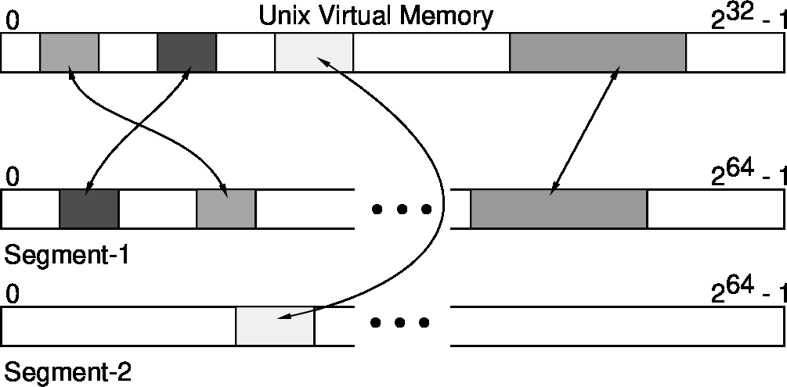
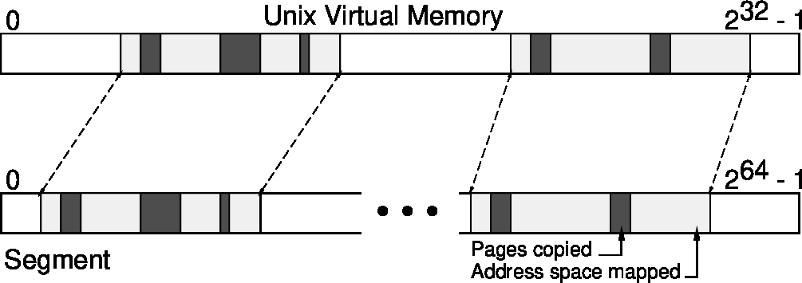

# The RVM Design

The basic structure of RVM is similar to most transaction systems.
It has a virtual memory cache manager, disk-based data storage, and a log
manager that records changes to the data to provide recovery after a crash.
Changes to the data are effected by transactions only.
Because RVM supports a byte-addressable recoverable virtual memory rather than a
collection of typed records, its disk storage and cache management differ most
from record-oriented systems. Each of these systems is detailed in this section.

In addition to the basic design features, RVM offers two additional,
optional mechanisms for the convenience of application builders.
A loader is provided that allows the creation and maintenance of a load map
for recoverable storage. The loader formalizes the layout and mapping of
recoverable storage using the mechanisms described in this chapter.
Using the loader also minimizes the number of library calls that must be
programmed. An allocator permits recoverable storage to also be used as a heap.
The functionality is similar to malloc and free, although with persistence.
The loader is used to automate reloading of the heap after shutdown or crash.
Details of these options are described in [RVM Segment Loader](rvm_segment_loader.md)
and [RDS, A Dynamic Heap Allocator](rds_allocator.md).

## Recoverable Storage

RVM manages recoverable storage in *segments*, which can be thought of as being
similar to Multics segments, although they can be much larger.
Any number of segments can be created and used on a machine, limited only by
its storage resources. Multiple instantiations of RVM can run simultaneously
on the same machine, although sharing of segments among processes is severely
constrained.

### Segment Structure

Segments are represented by files or disk partitions (or any other random access
device) which RVM presumes to be structureless. Since Unix can name partitions
as special files, storage for segments will be referred to from now on as files.
The file name is also the segments name in RVM. The maximum segment size is
determined by the static allocation of the file, with a limit of 2^64 bytes so
that large disks can be supported. The 64 bit addresses are represented as two
unsigned long integers since not all machines support an eight byte integer format.

The segment file represents the image of the recoverable memory with an address
space from zero to the maximum size of the file in bytes. The contents of the
data file is the applications responsibility, although it can only be modified
in RVM via transactions.

The address space is linearly mapped onto the data file so locality of data
in the address space implies locality in the file. When partitions are used,
applications can minimize disk accesses and head movement by allocating related
data locally. Alternatively, dispersing data copies in the address space can give
some protection from local media errors without resorting to mirrored storage.
Since only local damage is the usual failure mode, dispersed copies are not
likely to be damaged simultaneously (see "Reimplementing the Cedar File
System"[@hagmann87]).

### The Log and Its Operations

To insure the integrity of the data segments across crashes, a dedicated log
file is used by RVM to record changes to segments as transactions are processed.
The log file records changes to all segments used by the application and is
declared to RVM at initialization time. The actual file can be a disk partition,
but using a RAM disk, which has no seek or rotational latencies, will give
better performance. If a RAM disk is used, it should be provided with an
uninterruptable power supply for protection from power failures.

If two or more instantiations of RVM are operating on the same machine and disk
partitions are used for the log files, the partitions should be allocated on
different disk drives if possible. If a single drive must be used, the actual
partitions should be placed on adjacent cylinders to minimize seek latencies.
Head movement between partitions can be a serious performance limitation.

Following the example of most database management systems, RVM uses *write-ahead*
logging to improve performance, recording only changes as a mapped region is
modified. The changes are typically smaller than the modified region, and if
modifications are scattered through a large region, the change records can be
much smaller. Therefore writing only changes will often be cheaper than writing
the entire region.

There are two log operations: *flush* and *truncation*. As transactions are
performed, records of segment changes are created and are written to the log
file in the flush operation. Periodically, the modifications represented by
the log records are applied to the data file. After this is done, the records
are removed from the log, and the log is said to be *truncated*. These operations
are usually automatically performed by RVM, but because log management is the
strongest determinant of performance, the operations are made visible and the
application can use knowledge of its operations to optimize their timing.

The log file must be initialized before it can be used by RVM. Initialization
is usually performed by the init_log command provided by the utility rvmutl,
but, for files only, can also be done by a library call, rvm_create_log.
The operation is quite simple since only the amount of storage allocated to log
records need be specified. The remaining initialization and maintenance is
provided by RVM. Details of log initialization and other functions of rvmutl
are provided in [rvmutl](rvmutl.md).

### Segment Mapping

The mapping of data from the data file to memory, a function supplied by the
cache manager in data base systems, is supported differently by RVM.
Mappings can not be automatic upon fetch of an object since a segment is an
unstructured space. The application must manage the virtual memory cache by
explicitly mapping and unmapping segment regions corresponding to application
objects, or collections of objects.

The relation of the data cache and the data file is independent of virtual
memory and should not be confused with mapping a file into virtual memory.
One of the underlying assumptions of RVMs design is that page backing and data
storage are orthogonal. For the application designer, this avoids having to pin
pages in memory or otherwise having to manage virtual memory, except to allocate
its own structures.

When a region is mapped in Unix, it is normally copied from the data file to
virtual memory. This copy-on-mapping method is illustrated below.
For large regions, copying can take some time, and designers should consider
mapping such regions at initialization and leaving them mapped as long as they
are required.

/// caption
*Data mapping with the copy-on-map method. All shaded areas are physically
copied to the addresses specified during mapping.*
///

For Mach applications, segment mapping can be done in cooperation with the
virtual memory system by using Machs external pager interface.
Mapped regions are copied into virtual memory on demand by the external pager,
so there is no I/O delay when a region is mapped. This mapping method is
illustrated below.

/// caption
*Data mapping with the copy-on-demand method. Address space is reserved by
mapping (lightly shaded areas), but the pages are not physically copied until
referenced (dark shading).*
///

Because virtual memory contains uncommitted changes, the pager is not permitted
to write pages back to the data file. If a page must be forced out of virtual
memory by the kernel, the external pager holds the page in its virtual memory,
which is, in turn, backed by the Mach default pager. Modifications to the data
file can be made only by transactions.

Although management of recoverable virtual memory is greatly simplified by not
using the data file as the paging backing store, application designers should be
aware that paging activity can seriously degrade performance and should match
virtual memory usage to available physical memory for best results.

RVM provides a standard external pager, but does not preempt the external pager
mechanism. When used, an external pager backs only the segments for which it was
specified; other virtual memory is backed by the Mach default pager.
Applications can supply external pagers for special cases, but great care must
be taken to coordinate with RVMs log truncation mechanism which updates the data
file. A thorough knowledge of the Mach external pager interface (see "Mach kernel
interface manual"[@mach90]) and RVM internals will be required.

Mach applications can also use the Unix copy-on-map method.
The choice of method is a mapping option that is made when the first region of
a segment is mapped, and can be different for each segment. When large regions
are mapped and the usage pattern is sparse, using the external pager will provide
the best service.

If a region is going to be completely replaced by a process that is not
dependent on the original data, the region may optionally be mapped without data
copying. In this case mapping simply associates the segment region with the
specified virtual memory addresses. This option is available on each mapping and
is not precluded by the mapping copy method chosen for the segment.

RVM, via the log, guarantees that data newly mapped by either mapping method
represents the committed image of the region. The cache and segment file will
remain consistent provided that applications use RVMs transaction mechanisms
exclusively to modify mapped regions. However, RVM cannot protect the cached
data against memory smashes, and there is no guarantee that corrupted data will
not be used in transactions.

Restrictions on segment mapping are minimal, but lead to simplified
implementation, and equivalent semantics between Mach and Unix mapping methods.
The most important restriction is that no region of a segment may be mapped
more than once by the same process. This eliminates the need for RVM to support
mechanisms to maintain the consistency of multiply mapped (cached) regions.
Also, no mappings can overlap in virtual memory. Attempts to multiply map, or
overlap, a region will raise an exception.

In both Mach and Unix, mapping must be done in integral page sized regions,
and the regions must be page aligned in virtual memory. Otherwise, regions can
be mapped to any area of the address space permitted by Unix or Mach.
Since a segment can be much larger than the address space, only the desired
region of a segment, rounded to integral page size, need be mapped. As many
segments as necessary can be simultaneously mapped by a process.

Regions can be unmapped on demand, but only when they have no uncommitted
transactions. Also, RVM retains no information about segment mappings after
segments are unmapped, so if absolute pointers are used in a segment,
applications must specify the same base address on each mapping.

### Segment Sharing

Sharing of a segment by multiple Unix processes or Mach tasks is only weakly
supported. Inter-process sharing would greatly increase the complexity of RVM
by requiring inter-process communication that can be avoided otherwise.
The reason for permitting any inter-process sharing is to support maintenance
utilities that will occasionally have to run concurrently with a server built
with RVM. Other uses are discouraged.

All Mach threads within a task share segment mappings. If concurrent access to
mappings is required in an application, using Mach is strongly suggested.
In the rest of this document, the term "thread" will be used to mean either a
Mach thread, Unix process, or a coroutine thread. Regardless of method,
synchronization of data access is entirely the responsibility of the application.

When it is necessary that two or more processes share a segment, there must be
no uncommitted transactions and the log must be empty before control of the
segment can be safely transferred. To be sure the log is empty, the relinquishing
process must commit or abort all transactions and force a log truncation.
A function is provided to query the status of a segment, locate any uncommitted
transactions, and return a flag if the log is empty. All regions that could be
affected in the shared access should be unmapped before control is transferred.

The process taking control of the segment must insure that other processes that
could map the shared region are blocked. It releases the segment by unmapping its
regions and truncating the log. When the original process regains control, it
restores the committed image in virtual memory by remapping the desired region(s).

Other mechanisms could be created by the application to insure cache consistency
and possibly avoid unmapping and remapping. The conditions of no outstanding
transactions and log empty are also necessary and sufficient for direct access
to the segment file by the application if necessary for special operations.
If such mechanisms or direct access are necessary, remember that RVM leaves
interprocess communication and synchronization strictly to the application.

## Transactions

RVM provides the basic transaction operations *begin*, *end*, and *abort*.
As a transaction proceeds, the state of the byte ranges affected by the
transaction are logically checkpointed so that they can be restored if the
transaction is aborted. If the transaction commits, the new state is recorded
in the log. Since RVM uses write-ahead logging, the region is not updated in
the data file immediately; the log entry provides permanence.

The only restrictions on transactions are that all changes must occur within
mapped regions, and that nested transactions are not supported.

### Transaction Types

RVMs applications will perform transactions on regions of widely varying sizes.
To permit the possibility of optimizing log operations, RVM supports several
transaction start and commit modes which control the creation of old and new
value log records.

Although most transactions are used to provide atomic changes, there are times
when an application does not need virtual memory restoration on abort.
In these cases, it is known that the current state of memory is worthless,
and no effort need be spent preparing for restoration. RVM supports no_restore
transactions when old value records are not necessary. Any transaction that
cannot be aborted by the application, or does not need virtual memory
restoration if aborted, is a candidate for no_restore.

Another opportunity for optimization occurs when many changes are made to a
concise region. In these cases, just one old or new value log record can be
created provided that the range of changes is known to the transaction manager
before the changes are made. This enhances performance because the allocation
and initialization costs of creating log records are often greater than the
cost of copying the information, particularly for small ranges.
Block copy operations are usually cheap.

To capitalize on block copy, both old and new value records are created by byte
ranges. Old value records are created as the ranges are specified, while new
value records created when the transaction commits will record all modifications.
Also, because the ranges of modification are known, no modify function is needed
and normal assignment statements can be used. The rvm_set_range function is used
to specify ranges and create old value records.

The rvm_modify_bytes function is also provided for convenience when the entire
range is to be modified. Both rvm_modify_bytes and rvm_set_range can be used in
the same transaction as needed.

The begin transaction modes are summarized below:

- **restore**: restore virtual memory on abort.
- **no_restore**: do not restore virtual memory on abort.

### Transaction Abort

Either the application or RVM can abort a transaction. RVM will automatically
abort only if there has been an internal problem, such as an I/O error or
resource exhaustion, that prevented logging the commit. This rare event will
cause an appropriate exception code to be returned.

If a restore mode transaction is aborted, the old value records are used to
restore the region affected to its exact state before the transaction began.
Applications can abort a transaction at any time, for any reason, with the
rvm_abort_transaction function.

### Transaction Commit

Once the application has completed all modifications, it then *commits* to the
changes by calling rvm_end_transaction. At this time, RVM makes permanent the
changes by copying them to the log file.

RVM provides two commit modes with different performance and permanence guarantees.
Guaranteeing permanence requires waiting for the log records to be flushed
(written) to the log file. After this is done, only a disaster destroying the
information in the log file can cause loss of the changes. The recovery
mechanisms can restore the changes in a less destructive crash.

The faster mode, no_flush, does not copy changes to the log file before reporting
success. There is no guarantee for change permanence since a system crash before
the file is written will cause loss of the changes. In this case, a quick commit
is preferred to the guarantee of permanence provided by flushing.
This is sometimes called a "lazy" commit[@eppinger91]. Permanence can be insured
at a later time by any transaction doing a commit with flush, or by the
application directly invoking the rvm_flush function.

The two types of commit are supported by the following options, either of which
can be used to commit a transaction begun in any mode:

- **flush**: guaranteed permanence of changes.
- **no_flush**: quick commit, no guarantee of permanence.

### Transaction Optimizations

RVM supports two levels of optimization in logging transactions.
Intra-transaction optimization coalesces ranges declared within a single
transaction. This eliminates redundant log records if the transaction declares
overlapping ranges. Also, adjacent ranges are coalesced into a single range for
logging.

When no_flush commit is used, a second level of optimization can be used.
Ranges in the currently committed transaction can be coalesced with those of
previous no_flush committed transactions that have not been flushed.
This can eliminate redundant log records if the same offsets in a segment are
modified by successive transactions.

These optimizations have together provided about a 50% improvement in log
efficiency and are recommended in most cases. Sometimes the log is a useful
debugging record, and since the optimizations do alter the exact transaction
history by eliminating redundant information, their use may not be desired.
The log management utility rvmutl can print the log to show the applications
transaction history, and has been a useful debugging tool.

## Concurrency in RVM

Applications have the option of using threads provided by the C Threads[@cooper88]
programming package. The application is responsible for protecting
access to its data structures by concurrent threads, but can otherwise use RVM
functions freely, with RVM synchronizing access to its internal structures.

This discussion of concurrency in RVM assumes that Mach preemptive threads are
in use (one Mach thread per C thread, -lthreads) library. However, RVM will also
work correctly if the coroutine C Thread (-lco_threads) library is linked for
debugging since the C Thread synchronization primitives are used exclusively.
The choice of thread type is made simply by linking the desired thread library.
Linking different versions of RVM for the thread types will not be necessary.
The Mach task implementation of C Threads, -ltask_threads library, must not be used.

RVM does not set or modify any of the C Thread control variables such as
mutex_spin_limit. This level of tuning is left to the application, which is also
responsible for setting thread stack limits via the shell limit command.

Unix applications can be built without thread support. This is the default build
procedure in the RVM distribution kit. By defining the Cthreads primitives in
terms of other thread package primitives, it is possible to use other thread
support. However, no formal interface for this exists at this time.

Inherent file delays and RVMs internal locking structure divide RVM functions
into two groups, distinguished by execution speed and probability of contention.
Functions that do not access files are inherently fast since they access only
virtual memory structures whose locking structure is specifically intended to
allow the maximum useful concurrency while minimizing synchronization overhead.

The fast functions are:

- rvm_begin_transaction
- rvm_abort_transaction
- rvm_set_range
- rvm_modify_bytes
- rvm_set_options
- rvm_query
- rvm_unmap
- rvm_terminate

Slow functions are those requiring synchronous file access:

- rvm_map
- rvm_end_transaction
- rvm_flush
- rvm_truncate

These functions will be sequentialized on their access to files.
First-come, first-served order prevails. Functions operating on separate files
will not contend at RVM level, but may at kernel level if those files are
supported by disk partitions on the same physical disk or controller.
The order of access will be determined by the kernel.

Several of these functions can be in the "fast" category under certain conditions:

- rvm_end_transaction will be quick in no_flush mode.
- rvm_truncate and rvm_flush will be fast if the log is empty.
- rvm_map, when operating on a segment backed by an external pager, will be
  much faster than when performing copy-on-map.

### Concurrency During Flush and Truncation

Because no_flush transactions do not require immediate access to the log file,
RVM permits them to commit during flushing or truncation. Transactions that
require exclusive access to the log (flush) mode must be serialized, with no
guarantee the commit order of simultaneously committing transactions.
This is controlled by the C Threads package and should be considered random.

Transaction commits in flush mode are allowed during log truncation.
RVM internally divides the log into two sections: the area being truncated,
and the remainder which becomes the active area of the log. This allows
transactions to commit while truncation proceeds, although a small delay might
occur due to contention for the log file. Truncation is considered lower priority
than commit and will yield control of the log after each access.
A committing transaction will flush all waiting no_flush transactions plus
itself before permitting truncation to proceed.

Applications can control the timing of truncation by either setting a threshold
for initiation, or by doing it themselves. If invoked by threshold, RVM uses an
internal thread to execute the truncation, and transactions continue.
If the application directly invokes rvm_truncate, truncation is synchronous
with the calling thread. Regardless of method, truncation should be initiated
soon enough that the remainder of the log is not filled before truncation
completes. Otherwise, transactions will be blocked until log space is available.
Details of truncation control can be found in the
[Options](rvm_library.md#rvm-options-descriptor) section.

Log truncation and rvm_map have special concurrency considerations because
rvm_map must insure that the data mapped represents the most recent committed
image of the segment, a state that is controlled by log truncation.
On the first mapping of a segment, a truncation will be needed if the log is
not empty. In subsequent mappings, truncation will be needed only if a modified
region is unmapped and then remapped with no intervening truncation.
In these cases, rvm_map will initiate truncation and must wait for its completion.

RVM attempts to minimize mapping delays due to truncation by keeping careful
track of what has been unmapped so that no unnecessary truncations are initiated.
The truncation mechanism also posts its progress so that mapping is delayed only
until the needed region of the data file has had all relevant log records applied
to it.

## Good Programming Practice

Good programming practice in building applications with RVM is quite simple.
There are only two areas where some caution must be observed: declaring
modification ranges to RVM, and using transactions in critical sections.

### Declaring Modification Ranges

Since RVM has no way to detect modifications to mapped regions unless they have
been declared by a call to rvm_set_range, programmers must be careful to insure
that all modifications are covered by such a declaration. Failure to do so
results in errors that are not detectable until the modified region is unmapped,
either explicitly, or by termination of execution. When the modified range is
again mapped, the undeclared modifications will be missing since they were not
included in the new values captured by transaction commit. This has been the
most common programming error noted in use of RVM, so if some modifications
thought to have been committed are missing after a restart, check the
rvm_set_range calls carefully to be sure that all modifications are covered.

The declaration of a modification range should always be made *before* the
modifications are actually assigned. This is mandatory when transactions are
begun in restore mode since the old values are preserved by rvm_set_range for
restoration if rvm_abort_transaction is called. If the assignments are made
before calling rvm_set_range, the opportunity to capture the old values is lost
and aborting the transaction will result in restoring the modifications rather
than the original data. In future versions, making modifications before calling
rvm_set_range may result in incorrect operation.

Declarations of modification ranges are most efficiently made by minimizing the
number of calls to rvm_set_range or rvm_modify_bytes. Since the overhead of a
modification range record in the log is significant, declaring the range to
include the entire modified object is often more efficient than declaring several
small changes within the object. This is true for objects up to 100 bytes or so.
One must be careful, though, not to include any part of an object that may be
modified by a concurrent transaction since this could cause uncommitted state
to be made permanent.

A second efficiency consideration is to declare a single modification range to
cover an entire array or other structure that is modified sequentially, such as
in an initialization. Declaring each element of a contiguous structure
individually can cause extra log overhead if transaction optimizations are not
enabled.

### Transactions in Critical Sections

When using transaction in critical sections, any locks protecting modified
objects must be held until after the transaction is either committed or aborted.
This is true for locks that are held when a transaction is started, and for those
acquired during the transaction.

RVM does not capture the new values for modification ranges until commit time,
so if a lock is released before a transaction is committed, there is the
possibility that a concurrent access could make additional changes that are not
part of the transaction. Similarly, if a lock is released before an abort, the
abort could restore values that are not meaningful to a concurrent transaction.
